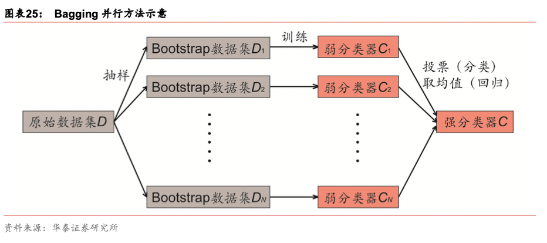

# 01

## 广义线性模型

## 线性判别分析和二次判别分析

## 支持向量机

## 决策树和随机森林

### Bootstrap

Bootstrap 方法的核心思想是有放回地抽样。我们首先从数据集中随机抽取一个样本，然后放回，再抽取一个样本，再放回，......，如此重复

随机“森林”(random forest)是由众多决策“树”组合而成的机器学习算法。 简单地说，多棵决策树通过 Bagging 的方式集成得到随机森林。具体而言，随机森林算法 根据以下两步方法建造每棵决策树。第一步称为“行采样”，从全体训练样本中有放回地 抽样，得到一个 Bootstrap 数据集。第二步称为“列采样”，从全部 M 个特征中随机选择 m 个特征(m 小于 M)，以 Bootstrap 数据集的 m 个特征为新的训练集，训练一棵决策树。 最终将全部 N 棵决策树以投票的方式组合。

### Bagging

和 Bagging 并行组合弱分类器的思想不同，AdaBoost(adaptive boosting)将弱分类器 以串行的方式组合起来，如图表 27 所示。在训练之前，我们赋予全部样本相等的权重。 第一步以原始数据为训练集，训练一个弱分类器 C1，如图表 28 左图所示。对于分类错误 的样本，提高其权重。第二步以更新样本权值后的数据为训练集，再次训练一个弱分类器 C2，如图表 28 中间图所示。随后重复上述过程，每次自适应地改变样本权重并训练弱分 类器，如图表 28 右图所示。最终，每个弱分类器都可以计算出它的加权训练样本分类错 误率，将全部弱分类器按一定权值进行组合得到强分类器，错误率越低的弱分类器所占权 重越高

## 神经网络和深度学习

## K最近邻

## 聚类

## 降维

## 参考

[人工智能1：人工智能选股框架及经典算法简介](https://pan.baidu.com/s/1l_QcAZ5cc8l6ry1YysWuYg?pwd=uzdq)